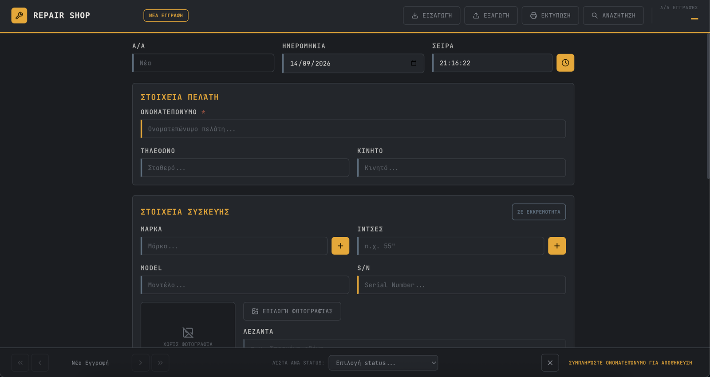

<div align="center">

```
 █████╗ ██╗     ███████╗██╗  ██╗    ██████╗ ██╗     ██╗ █████╗ ████████╗███████╗██╗██╗  ██╗ █████╗ ███████╗
██╔══██╗██║     ██╔════╝╚██╗██╔╝    ██╔══██╗██║     ██║██╔══██╗╚══██╔══╝██╔════╝██║██║ ██╔╝██╔══██╗██╔════╝
███████║██║     █████╗   ╚███╔╝     ██████╔╝██║     ██║███████║   ██║   ███████╗██║█████╔╝ ███████║███████╗
██╔══██║██║     ██╔══╝   ██╔██╗     ██╔═══╝ ██║     ██║██╔══██║   ██║   ╚════██║██║██╔═██╗ ██╔══██║╚════██║
██║  ██║███████╗███████╗██╔╝ ██╗    ██║     ███████╗██║██║  ██║   ██║   ███████║██║██║  ██╗██║  ██║███████║
╚═╝  ╚═╝╚══════╝╚══════╝╚═╝  ╚═╝    ╚═╝     ╚══════╝╚═╝╚═╝  ╚═╝   ╚═╝   ╚══════╝╚═╝╚═╝  ╚═╝╚═╝  ╚═╝╚══════╝
```

### `Fullstack engineer. Building real products from database to UI.`

**Portfolio & bio site → [pliatsikas.github.io/bio-page](https://pliatsikas.github.io/bio-page/)**

[](https://pliatsikas.github.io/bio-page/)
[](mailto:alexandrospliatsikas8@gmail.com)
[](https://github.com/Pliatsikas)

</div>

---

### 🌐 About this site

The source of my portfolio. Three pages plus one case study, built with **React 19 + Vite 8 + React Router 7**, plain CSS with a dark industrial theme, a GSAP-driven interactive dot grid and a custom cursor. Deployed to GitHub Pages.

| Route | What's there |
|---|---|
| [`/`](https://pliatsikas.github.io/bio-page/) | Bio, focus areas, skill levels |
| [`/projects`](https://pliatsikas.github.io/bio-page/projects) | Selected projects with live/source links |
| [`/projects/repair-shop-app`](https://pliatsikas.github.io/bio-page/projects/repair-shop-app) | Case study — freelance Electron desktop app for a repair shop |
| [`/certificates`](https://pliatsikas.github.io/bio-page/certificates) | Certifications |

```bash
npm install
npm run dev       # local dev server
npm run build     # production build → dist/ (also writes 404.html for SPA deep links)
npm run deploy    # build + publish dist/ to the gh-pages branch
```

---

### 👾 About Me

```yaml
name:       Alex Pliatsikas
location:   Thessaloniki, GR
education:  Applied Informatics @ University of Macedonia
year:       4th (Final Year)
thesis:     RAG Pipelines & LLM Evaluation
focus:
  - Fullstack web engineering (Next.js, Node.js, PostgreSQL)
  - LLM products with grounding, evals & usage budgets
  - Desktop apps for real clients (Electron, SQLite)
  - Real-time systems & production deployments (Docker, Vercel, Render)
status:     Always learning
```

---

### 🚀 Selected Projects

| Project | Description | Tags |
|---|---|---|
| **[Job Hunt Copilot](https://github.com/Pliatsikas/job-hunt-copilot)** · [🔗 Live](https://job-hunt-copilot-gamma.vercel.app) | Paste a job ad, get a grounded match score against your CV (every match quotes the CV verbatim), the gaps worth preparing for, and a streamed cover letter. Multi-provider LLM layer with Zod validation + repair, fabrication detector, per-user usage budgets, eval suite | `Next.js 15` `TypeScript` `Prisma 7` `PostgreSQL` `Auth.js` `Groq` `Gemini` `Vitest` |
| **[Repair Shop Management App](https://pliatsikas.github.io/bio-page/projects/repair-shop-app)** · freelance | Offline-first Electron desktop app for a small electronics repair business — replaced a legacy MS Access DB. Autosave, search, status lists, duplicate-serial detection, photo per repair, A4 print, Excel + direct `.mdb` import, PIN lock, daily backups. Delivered & installed for the client (private source) | `Electron` `React` `TypeScript` `Prisma` `SQLite` `Tailwind` |
| **[Aura Immersive Web Experience](https://github.com/Pliatsikas/aura-site-demo)** · [🔗 Live](https://aura-sand-pi.vercel.app/) | Next-gen architectural portfolio with WebGL fluid simulations & custom shaders via Next.js + React Three Fiber | `WebGL` `Next.js` `Framer Motion` |
| **[TaskFlow](https://github.com/Pliatsikas/TaskFlow)** · [🔗 Live](https://taskflow-client-lake.vercel.app) | Production Kanban SaaS — monorepo, REST API, JWT auth with refresh tokens, real-time drag & drop via WebSockets, Docker deployment on Vercel + Render | `Next.js` `Node.js` `PostgreSQL` `Socket.io` `Docker` `TypeScript` |
| **E-Avenue Jira AI Copilot** | Intelligent workspace assistant using RAG to synthesize knowledge bases and historical Jira tickets for instant issue resolution | `Generative AI` `RAG` `NLP` |
| **Rentalbook OCR Engine** | High-precision OCR pipeline that extracts data from passports & national IDs to automate user verification in real time | `OCR` `Computer Vision` `Automation` |

<div align="center">
<a href="https://pliatsikas.github.io/bio-page/projects/repair-shop-app"></a>
<br/><sub>Repair Shop Management App — <a href="https://pliatsikas.github.io/bio-page/projects/repair-shop-app">read the case study</a></sub>
</div>

---

### 🛠️ Tech Stack

<div align="center">

**Frontend & Desktop**


**Backend & Database**


**DevOps, Testing & Tooling**


**AI & Data**


</div>

---

### 📜 Certifications

```
✦ HTML & CSS Crash Course     —  Scrimba   · 2025
✦ Responsive Web Design       —  Scrimba   · 2025
✦ Learn SQL                   —  Scrimba   · 2025
✦ Learn RAG                   —  Scrimba   · 2026
✦ PHP Crash Course            —  Udemy     · 2026
```

---

<div align="center">

**→ [pliatsikas.github.io/bio-page](https://pliatsikas.github.io/bio-page/) ←**

`Fullstack · AI · Desktop · Real-time · Production`

</div>
